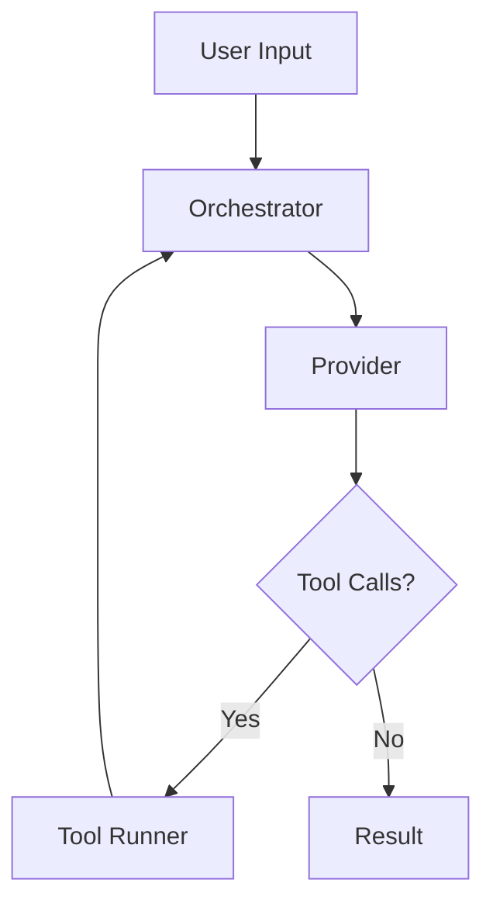

## Output Structure

A design document should contain the following sections:

### 1. Overview

A brief summary of the feature, its motivation, and the problem it solves.

### 2. Code Stubs for Key Abstractions

Provide skeleton code for the core types, interfaces, and functions that
make up the design. Each stub should include:

- A **docstring** explaining the abstraction's purpose, responsibilities,
  and how it fits into the larger design.
- **Pseudocode** inside key functions describing the intended logic
  step-by-step, rather than leaving empty bodies.

```python
class Orchestrator:
    """Coordinates execution across providers and tools.

    Owns the main run-loop: receives a user message, dispatches to the
    active provider, executes any returned tool calls, and accumulates
    state until the provider signals completion.
    """

    async def run(self, message: str) -> Result:
        # 1. Append user message to conversation state
        # 2. Loop:
        #    a. Send current state to provider
        #    b. If response contains tool calls, execute them and append results
        #    c. If response is final, break
        # 3. Return accumulated result
        ...
```

### 3. Diagrams

Include **Mermaid diagrams** to illustrate:

- **Data flow** — how data moves through the feature from input to output.
- **Component relationships** — how the key abstractions relate to and
  depend on each other.



If the **Excalidraw MCP** server is available, also produce Excalidraw
diagrams for more expressive or freeform visuals (architecture overviews,
state machines, etc.). Check for MCP availability before attempting this.

### 4. Testing Plan

Outline how the design will be validated. Include:

- **Unit tests** — which abstractions will be tested in isolation and what
  behaviors will be asserted.
- **Integration tests** — which cross-component paths will be exercised.
- **Mock strategy** — which external dependencies will be mocked and how.
- **Edge cases** — known boundary conditions or failure modes to cover.

---

## Conventions

- Write stubs in the project's primary language, matching existing code style.
- Keep diagrams focused — one concept per diagram. Prefer multiple simple
  diagrams over a single overloaded one.
- The design document is a **living artifact**: update it as implementation
  reveals new constraints or decisions.
- Store the document alongside the code it describes (e.g., `docs/design/` or
  at the feature root) so it stays discoverable.
